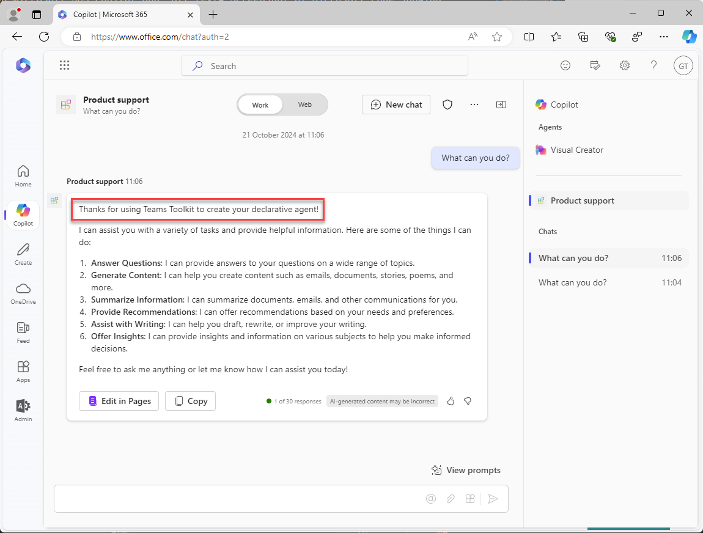

---
lab:
  title: 练习 1 - 在 Visual Studio Code 中创建声明性代理
  module: 'LAB 01: Build a declarative agent for Microsoft 365 Copilot using Visual Studio Code'
---

# 练习 1 - 创建声明性代理

在本练习中，将从模板创建声明性代理项目、更新清单、将代理上传到 Microsoft 365，并在 Microsoft 365 Copilot 中测试代理。 

在 Microsoft 365 应用中实现声明性代理。 创建一个应用包，其中包含：

- app.manifest.json：应用部件清单 (manifest) 文件描述应用的配置方式，包括其功能。
- declarative-agent.json：声明性代理清单描述声明性代理的配置方式。
- color.png and outline.png：用于在 Microsoft 365 Copilot 用户界面中表示声明性代理的颜色和轮廓图标。

### 练习用时

- **估计完成时间：** 15 分钟

## 任务 1 - 下载初学者项目

首先，在 Web 浏览器中从 GitHub 下载示例项目：

1. 导航到 [https://github.com/microsoft/learn-declarative-agent-vscode](https://github.com/microsoft/learn-declarative-agent-vscode) 模板库。
    1. 按照步骤，[将存储库源代码下载](https://docs.github.com/repositories/working-with-files/using-files/downloading-source-code-archives#downloading-source-code-archives-from-the-repository-view)到计算机。
    1. 将下载的 zip 文件的内容解压缩到 **Documents 文件夹**。

开场白项目包含 Teams 工具包项目，其中包含声明性代理。

1. 在 Visual Studio Code 中打开  项目文件夹。
1. 在项目根文件夹中，打开 **README.md** 文件。 检查内容以获取有关项目结构的详细信息。


## 任务 2 - 检查声明性代理清单

让我们检查声明性代理清单文件：

- 打开 **appPackage/declarativeAgent.json** 文件并检查内容：

    ```json
    {
        "$schema": "https://aka.ms/json-schemas/agent/declarative-agent/v1.0/schema.json",
        "version": "v1.0",
        "name": "da-product-support",
        "description": "Declarative agent created with Teams Toolkit",
        "instructions": "$[file('instruction.txt')]"
    }
    ```

**instructions** 属性的值包含对名为 **instruction.txt** 的文件的引用。 **$[file(path)]** 函数由 Teams 工具包提供。 在预配到 Microsoft 365 时，**instruction.txt** 的内容包含在声明性代理清单文件中。

- 在 **appPackage** 文件夹中，打开 **instruction.txt** 文件并查看内容：

    ```md
    You are a declarative agent and were created with Team Toolkit. You should start every response and answer to the user with "Thanks for using Teams Toolkit to create your declarative agent!\n\n" and then answer the questions and help the user.
    ```

## 任务 3 - 更新声明性代理清单

让我们更新 **name** 和 **description** 属性，使其更符合我们的方案。

1. 在 **appPackage** 文件夹中，打开 **declarativeAgent.json** 文件。
1. 将 **name** 属性值更新为 **Product support**。
1. 将 **description** 属性值更新为 **Product support agent that can help answer customer queries about Contoso Electronics products**。
1. 保存所做的更改

更新后的文件应包含以下内容：

```json
{
    "$schema": "https://aka.ms/json-schemas/agent/declarative-agent/v1.0/schema.json",
    "version": "v1.0",
    "name": "Product support",
    "description": "Product support agent that can help answer customer queries about Contoso Electronics products",
    "instructions": "$[file('instruction.txt')]"
}
```

## 任务 4 - 将声明性代理上传到 Microsoft 365

> [!IMPORTANT]
> 在开始之前，请确保已在 Visual Studio Code 中安装 Teams 工具包扩展。 如果尚未从商城安装扩展，请立即执行此操作。

接下来，将声明性代理上传到 Microsoft 365 租户。

在 Visual Studio Code 中：

1. 在 **活动栏**中，打开“**Teams 工具包**”扩展。

    

1. 在“**生命周期**”部分中，选择“**预配**”。

    

1. 在提示中，选择“**登录**”，然后按照提示使用 Teams 工具包登录到 Microsoft 365 租户。 登录后，预配过程会自动启动。

    

    

1. 等待上传完成，然后继续。

    

接下来，查看预配过程的输出。

- 在 **appPackage/build** 文件夹中，打开 **declarativeAgent.dev.json** 文件。

请注意，**instructions** 属性值包含 **instruction.txt** 文件的内容。 **declarativeAgent.dev.json** 文件随 **manifest.dev.json**、**color.png** 和 **outline.png** 文件一起包含在 **appPackage.dev.zip** 文件中。 **appPackage.dev.zip** 文件上传到 Microsoft 365。

## 任务 5 - 在 Microsoft 365 Copilot 中测试声明性代理

接下来，让我们在 Microsoft 365 Copilot 中运行声明性代理，并在**上下文中**体验和**沉浸式**体验中验证其功能。

在 Visual Studio Code 中：

1. 在“**活动栏**”中，切换到“**运行和调试**”视图。

    

1. 选择配置下拉列表旁边的“**开始调试**”按钮，或按 <kbd>F5</kbd>。 将启动新的浏览器窗口并导航到 Microsoft 365 Copilot。

    

    

    

在浏览器中继续，让我们测试**上下文中**体验。

1. 在 **Microsoft 365 Copilot** 中，在消息框中输入符号<kbd>@</kbd>。 浮出控件将显示一个可用代理列表。

    

1. 在浮出控件中，选择“**产品支持**”。 请注意消息框上方的状态消息。 它显示“**与产品支持聊天**”，表示你正在使用代理的上下文中体验。

    

1. 在文本框中，输入“**你能做什么？**”，然后提交消息。

    

1. 正在等待响应。 请注意，响应如何以文本“感谢你使用 Teams Toolkit 创建声明性代理！”开头。 如前面查看的指令中所定义的。

    

1. 若要退出上下文中体验，请在状态消息中选择交叉 (X)。 请注意，状态消息已删除，并且聊天窗口中会显示一条消息，指示你不再与代理聊天。

    

    

最后，让我们测试**沉浸式**体验。

在浏览器中继续：

1. 在 **Microsoft 365 Copilot** 中，选择右上角的图标以展开 Copilot 侧面板。 请注意，面板显示最近的聊天和可用的代理。

    

1. 在侧面板中，选择“**产品支持**”以输入沉浸式体验并直接与代理聊天。 请注意界面中显示的两个示例提示。

    

1. 选择标题为“**了解详细信息**”的示例提示。 请注意，文本“**你能做什么？**”已添加到消息框中。

    

1. 发送消息并等待响应。 请注意，响应如何以文本“感谢你使用 Teams Toolkit 创建声明性代理！”开头。 如前面查看的指令中所定义的。

    

最后，关闭浏览器以停止 Visual Studio Code 中的调试会话。