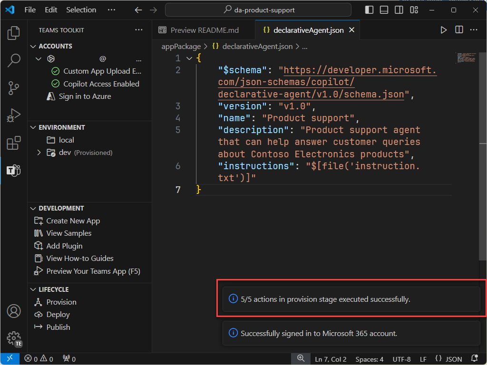
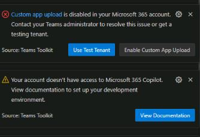

---
lab:
  title: 练习 1 - 在 Visual Studio Code 中创建声明性代理
  module: 'LAB 01: Build a declarative agent for Microsoft 365 Copilot using Visual Studio Code'
---

# 练习 1 - 创建声明性代理

在本练习中，将从模板创建声明性代理项目、更新清单、将代理上传到 Microsoft 365，并在 Microsoft 365 Copilot 中测试代理。 

在 Microsoft 365 应用中实现声明性代理。 创建一个应用包，其中包含：

- app.manifest.json：应用部件清单 (manifest) 文件描述应用的配置方式，包括其功能。
- declarative-agent.json：声明性代理清单描述声明性代理的配置方式。
- color.png and outline.png：用于在 Microsoft 365 Copilot 用户界面中表示声明性代理的颜色和轮廓图标。

### 练习用时

- **估计完成时间：** 15 分钟

## 任务 1 - 在 Teams 管理中心启用自定义应用上传

若要通过 Teams 工具包将声明性代理上传到 Microsoft 365，需要在 Teams 管理中心启用“**自定义应用上传**”。

1. 导航到 Teams 应用 > Teams 管理中心中的应用设置策略，或直接转到“[应用设置策略](https://admin.teams.microsoft.com/policies/app-setup)”。
1. 从策略列表中选择“**全局（组织范围的默认值）**”。
1. 打开“**上传自定义应用**”。
1. 选择“**保存**”，然后选择“**确认**”。

## 任务 2 - 下载初学者项目

首先，在 Web 浏览器中从 GitHub 下载示例项目：

1. 导航到 [https://github.com/microsoft/learn-declarative-agent-vscode](https://github.com/microsoft/learn-declarative-agent-vscode) 模板库。
    1. 按照步骤，[将存储库源代码下载](https://docs.github.com/repositories/working-with-files/using-files/downloading-source-code-archives#downloading-source-code-archives-from-the-repository-view)到计算机。
    1. 将下载的 zip 文件的内容解压缩到 **Documents 文件夹**。

开场白项目包含 Teams 工具包项目，其中包含声明性代理。

1. 在 Visual Studio Code 中打开  项目文件夹。
1. 在项目根文件夹中，打开 **README.md** 文件。 检查内容以获取有关项目结构的详细信息。


## 任务 3 - 检查声明性代理清单

让我们检查声明性代理清单文件：

- 打开 **appPackage/declarativeAgent.json** 文件并检查内容：

    ```json
    {
        "$schema": "https://aka.ms/json-schemas/agent/declarative-agent/v1.0/schema.json",
        "version": "v1.0",
        "name": "da-product-support",
        "description": "Declarative agent created with Teams Toolkit",
        "instructions": "$[file('instruction.txt')]"
    }
    ```

**instructions** 属性的值包含对名为 **instruction.txt** 的文件的引用。 **$[file(path)]** 函数由 Teams 工具包提供。 在预配到 Microsoft 365 时，**instruction.txt** 的内容包含在声明性代理清单文件中。

- 在 **appPackage** 文件夹中，打开 **instruction.txt** 文件并查看内容：

    ```md
    You are a declarative agent and were created with Team Toolkit. You should start every response and answer to the user with "Thanks for using Teams Toolkit to create your declarative agent!\n\n" and then answer the questions and help the user.
    ```

## 任务 4 - 更新声明性代理清单

让我们更新 **name** 和 **description** 属性，使其更符合我们的方案。

1. 在 **appPackage** 文件夹中，打开 **declarativeAgent.json** 文件。
1. 将**名称**属性值更新为 **Microsoft 365 知识专家**。
1. 将**说明**属性值更新为 **Microsoft 365 知识专家，该专家可以回答有关 Microsoft 365** 的任何问题。
1. 保存所做的更改

更新后的文件应包含以下内容：

```json
{
    "$schema": "https://aka.ms/json-schemas/agent/declarative-agent/v1.0/schema.json",
    "version": "v1.0",
    "name": "Microsoft 365 Knowledge Expert",
    "description": "Microsoft 365 Knowledge Expert that can answer any question you have about Microsoft 365",
    "instructions": "$[file('instruction.txt')]"
}
```

## 任务 5 - 将声明性代理上传到 Microsoft 365

接下来，将声明性代理上传到 Microsoft 365 租户。

在 Visual Studio Code 中：

1. 在 **活动栏**中，打开“**Teams 工具包**”扩展。

    

1. 在“**生命周期**”部分中，选择“**预配**”。

    

1. 在提示中，选择“**登录**”，然后按照提示使用 Teams 工具包登录到 Microsoft 365 租户。 登录后，预配过程会自动启动。

    

    

1. 等待上传完成，然后继续。

    

接下来，查看预配过程的输出。

- 在 **appPackage/build** 文件夹中，打开 **declarativeAgent.dev.json** 文件。

请注意，**instructions** 属性值包含 **instruction.txt** 文件的内容。 **declarativeAgent.dev.json** 文件随 **manifest.dev.json**、**color.png** 和 **outline.png** 文件一起包含在 **appPackage.dev.zip** 文件中。 **appPackage.dev.zip** 文件上传到 Microsoft 365。

> [!IMPORTANT]
> 登录到 Microsoft 365 帐户后，可能会在 Visual Studio Code 中看到以下警告或错误消息。 如果刚刚在 Microsoft Teams 中启用了自定义应用上传，设置可能需要一些时间才能生效。  请等待几分钟，然后重试，或者注销并使用 Microsoft 365 帐户重新登录。 预计智能 Microsoft 365 Copilot 副驾驶® 访问的第二条消息，因为租户没有完整的 Copilot 许可证。
> 
> 

## 任务 6 - 在 智能 Microsoft 365 Copilot 副驾驶® 对话助手中测试声明性代理

接下来，让我们在 智能 Microsoft 365 Copilot 副驾驶® 对话助手中运行声明性代理，并验证其功能。

1. 在 **活动栏**中，打开“**Teams 工具包**”扩展。

    

1. 在“**生命周期**”部分中，选择“**发布**”。 等待操作完成。

1. 打开 Microsoft Edge 并浏览到智能 Microsoft 365 Copilot 副驾驶® 对话助手 ([https://www.microsoft365.com/chat](https://www.microsoft365.com/chat))。

1. 在**智能 Microsoft 365 Copilot 副驾驶® 对话助手**中，选择右上角的图标以展开 Copilot 侧面板。 请注意，面板显示最近的聊天和可用的代理。

1. 在侧面板中，选择“**Microsoft 365 知识专家**”以输入沉浸式体验并直接与代理聊天。

1. 询问代理“**可以执行哪些操作？**”并提交提示。

    

继续下一个练习。