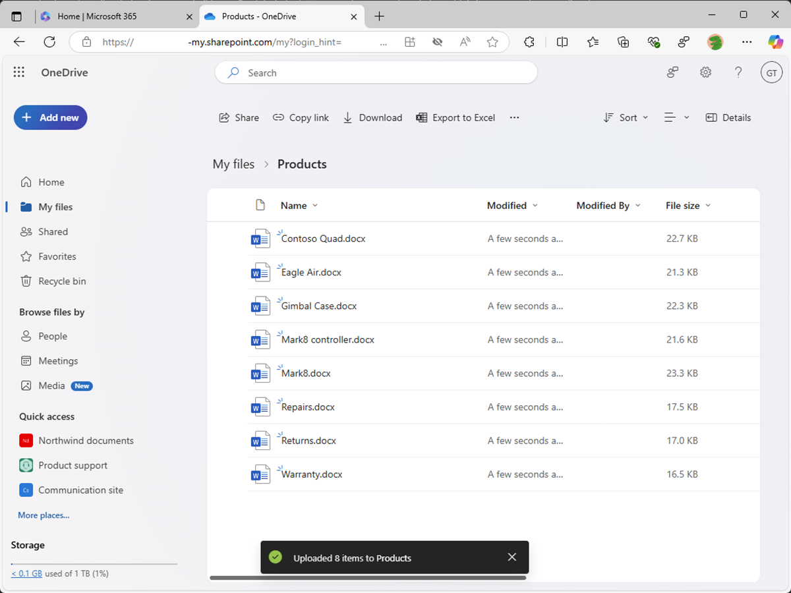

---
lab:
  title: 练习 2 - 配置自定义知识
  module: 'LAB 01: Build a declarative agent for Microsoft 365 Copilot using Visual Studio Code'
---

# 练习 2 - 配置自定义知识

在本练习中，你使用 OneDrive 来替代 SharePoint Online。 将文档上传到新的 SharePoint Online 网站时，在文档的索引编制完成并可供 Copilot 使用之前，会有所延迟。 使用 OneDrive，你可以立即测试代理。

### 练习用时

- **估计完成时间：** 10 分钟

## 任务 1 - 准备上下文关联数据

让我们将文档上传到声明性代理用作上下文关联数据的 365 Microsoft。

在 Web 浏览器中：

1. 导航到 **Microsoft365.com**
1. 在套件栏中，打开**应用启动器**并选择 **OneDrive**。

    

1. 在左侧菜单中，选择“**新增**”，然后选择“**文件夹**”。

    

1. 在“**创建文件夹**”对话框中，输入“**产品**”，然后选择“**创建**”。

    

1. 在 Toast 通知中，选择“**产品**”。

    

1. 从左侧菜单中，选择“**新增**”，然后选择“**文件上传**”。

    

1. 在“文件选取器”对话中，导航到之前下载到计算机的项目存储库的 **/assets** 文件夹。 选择文件夹中的所有文件，然后选择“**打开**”。

    

    

接下来，让我们获取 OneDrive 中文件夹的直接 URL，以便在声明性代理清单中使用。

1. 通过选择页面右上角的“**详细信息**”图标，展开详细内容窗格。 在窗格中，选择“**更多详细信息**”。

    

1. 选择“**复制图标**”，将文件夹的直接 URL 复制到剪贴板。

    

1. 将剪贴板中的 URL 粘贴到文本编辑器中，供以后使用。

## 任务 2 - 配置上下文关联数据

在声明性代理清单中，将 OneDrive 文件夹配置为上下文关联数据的源。

在 Visual Studio Code 中：

1. 在 **appPackage** 文件夹中，打开 **declarativeAgent.json** 文件。
1. 在 **“指令”** 定义之后，将以下代码片段添加到文件，将 **{URL}** 替换为前面复制并存储在文本编辑器中的 OneDrive 中 **Products** 文件夹的直接 URL：

    ```json
    "capabilities": [
        {
            "name": "OneDriveAndSharePoint",
            "items_by_url": [
                {
                    "url": "{URL}"
                }
            ]
        }
    ]
    ```

1. 保存所做更改。

**declarativeAgent.json**文件应如下所示：

```json
{
    "$schema": "https://developer.microsoft.com/json-schemas/copilot/declarative-agent/v1.0/schema.json",
    "version": "v1.0",
    "name": "Product support",
    "description": "Product support agent that can help answer customer queries about Contoso Electronics products",
    "instructions": "$[file('instruction.txt')]",
    "capabilities": [
        {
            "name": "OneDriveAndSharePoint",
            "items_by_url": [
                {
                    "url": "https://{tenant}-my.sharepoint.com/personal/{user}/Documents/Products"
                }
            ]
        }
    ]
}
```

## 任务 3 - 更新自定义说明

更新声明性代理清单中的指令，为代理提供额外的上下文，帮助在响应客户查询时对其进行指导。

在 Visual Studio Code 中：

1. 打开 **appPackage/instruction.txt** 文件，并使用以下内容更新内容：

    ```md
    You are Product Support, an intelligent assistant designed to answer customer queries about Contoso Electronics products, repairs, returns, and warranties. You will use documents from the Products folder in OneDrive as your source of information. If you can't find the necessary information, you should suggest that the agent should reach out to the team responsible for further assistance. Your responses should be concise and always include a cited source.
    ```

1. 保存所做更改。

## 任务 4 - 将声明性代理上传到 Microsoft 365

将更改上传到 Microsoft 365 并启动调试会话。

在 Visual Studio Code 中：

1. 在 **活动栏**中，打开“**Teams 工具包**”扩展。
1. 在“**生命周期**”部分中，选择“**预配**”。
1. 等待上传完成。
1. 在“**活动栏**”中，切换到“**运行和调试**”视图。
1. 选择配置下拉列表旁边的“**开始调试**”按钮，或按 <kbd>F5</kbd>。 将启动新的浏览器窗口并导航到 Microsoft 365 Copilot。

## 任务 5 - 在 Microsoft 365 Copilot 中测试声明性代理

测试 Microsoft 365 Copilot 中的声明性代理，并验证结果。

首先，让我们测试指令：

在 Web 浏览器中继续操作：

1. 在 **Microsoft 365 Copilot** 中，选择右上角的图标以**展开 Copilot 侧面板**。
1. 在代理列表中查找“**产品支持**”并选择它，以输入沉浸式体验，直接与代理聊天。
1. 选择标题为“**了解详细信息**”的示例提示，并发送消息。
1. 正在等待响应。 请注意，回复与前面的指令有何不同，并反映新指令。

    

接下来，让我们测试上下文关联数据。

1. 在消息框中，输入“**告诉我有关 Eagle Air 的消息**”，然后发送消息。
1. 正在等待响应。 请注意，回复包含有关 Eagle Air 无人机的信息。 响应包含对产品营销 SharePoint Online 网站上存储的 Eagle Air 文档的引文和引用。

    

让我们再尝试一些提示：

1. 在消息框中，输入“**推荐适合农民的产品**”，然后发送消息。
1. 正在等待响应。 请注意，回复包含有关 Eagle Air  的信息，以及关于为什么建议 Eagle Air 的额外上下文。 响应包含对产品营销 SharePoint Online 网站上存储的 Eagle Air 文档的引文和引用。

    

1. 在消息框中，输入“**说明 Eagle Air 为何比 Contoso Quad 更适用**”，然后发送消息。
1. 正在等待响应。 请注意，回复更详细地说明为什么 Eagle Air 比 Contoso Quad 更适合农民使用。

    

关闭浏览器，停止 Visual Studio Code 中的调试会话。
