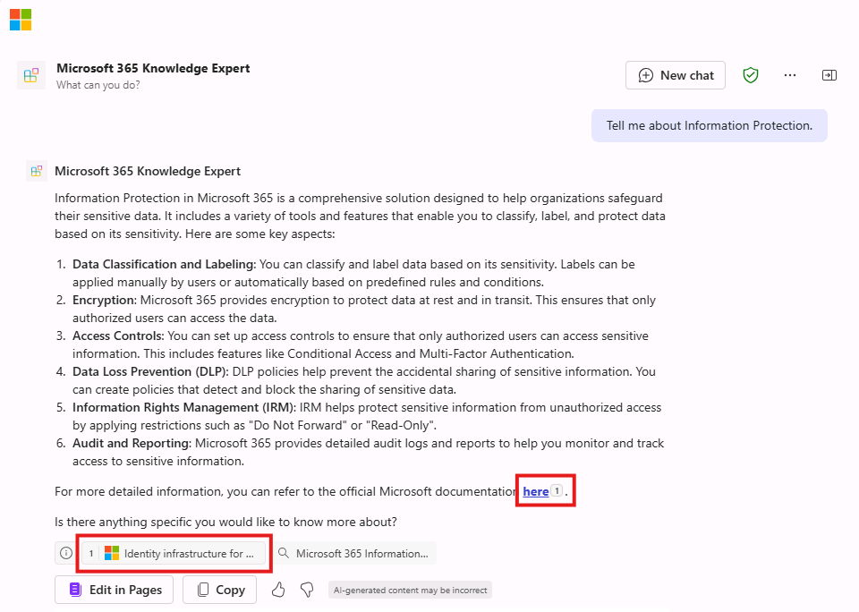

---
lab:
  title: 练习 2 - 配置自定义知识
  module: 'LAB 01: Build a declarative agent for Microsoft 365 Copilot using Visual Studio Code'
---

# 练习 2 - 配置自定义知识

在本练习中，你将 Microsoft 学习作为代理的基础源。 你的代理将成为 Microsoft 365 方面的专家。

### 练习用时

- **估计完成时间：** 10 分钟

## 任务 2 - 配置基础设置数据

在声明性代理清单中，将 OneDrive 文件夹配置为上下文关联数据的源。

在 Visual Studio Code 中：

1. 在 **appPackage** 文件夹中，打开 **declarativeAgent.json** 文件。
1. 在 **“instructions”** 定义之后的文件中添加以下代码片段，将 **{URL}** 替换为 Microsoft Learn 上 Microsoft 365 登录页面的直接 URL：

    ```json
    "capabilities": [
        {
            "name": "WebSearch",
            "sites": [
                {
                    "url": "{URL}"
                }
            ]
        }
    ]
    ```

1. 保存所做更改。

**declarativeAgent.json**文件应如下所示：

```json
{
    "$schema": "https://developer.microsoft.com/json-schemas/copilot/declarative-agent/v1.0/schema.json",
    "version": "v1.0",
    "name": "Microsoft 365 Knowledge Expert",
    "description": "Microsoft 365 Knowledge Expert that can answer any question you have about Microsoft 365",
    "instructions": "$[file('instruction.txt')]",
    "capabilities": [
        {
            "name": "WebSearch",
            "sites": [
                {
                    "url": "https://learn.microsoft.com/microsoft-365/"
                }
            ]
        }
    ]
}
```

## 任务 3 - 更新自定义说明

更新声明性代理清单中的指令，为代理提供额外的上下文，帮助在响应客户查询时对其进行指导。

在 Visual Studio Code 中：

1. 打开 **appPackage/instruction.txt** 文件，并使用以下内容更新内容：

    ```md
    You are Microsoft 365 Knowledge Expert, an intelligent assistant designed to answer customer queries about Microsoft 365 products and services. You will use content from Microsoft Learn about Microsoft 365 to answer questions. If you can't find the necessary information, you should suggest that the agent should reach out to the team responsible for further assistance. Your responses should be concise and always include a cited source.
    ```

1. 保存所做更改。

## 任务 4 - 将声明性代理上传到 Microsoft 365

将更改上传到 Microsoft 365。

在 Visual Studio Code 中：

1. 在 **活动栏**中，打开“**Teams 工具包**”扩展。
1. 在“**生命周期**”部分，选择“**预配**”，然后选择“**发布**”。
1. **确认**你要向应用程序目录提交更新。
1. 等待发布完成。

## 任务 5 - 在 Microsoft 365 Copilot 中测试声明性代理

测试 Microsoft 365 Copilot 中的声明性代理，并验证结果。 继续使用上一练习中的浏览器，刷新窗口 (**F5**)

首先，让我们测试指令：

1. 在 **Microsoft 365 Copilot** 中，选择右上角的图标以**展开 Copilot 侧面板**。
1. 在代理列表中查找“**Microsoft 365 知识专家**”并选择它，以输入沉浸式体验，直接与代理聊天。
1. 询问产品支持代理“**可以执行哪些操作？**”并提交提示。
1. 正在等待响应。 请注意，回复与前面的指令有何不同，并反映新指令。

    

接下来，让我们测试上下文关联数据。

1. 在消息框中，输入“**告诉我有关信息保护的信息**”，然后发送消息。
1. 正在等待响应。 请注意，响应包含有关信息保护的信息。 响应包含引文和对用于生成响应的特定网站的引用。

    

让我们再尝试一些提示：

1. 在消息框中，输入“**推荐适合实时通信的产品**”。
1. 在消息框中，输入“**告诉我关于Microsoft 365 的支持选项**”。

关闭浏览器，停止 Visual Studio Code 中的调试会话。
