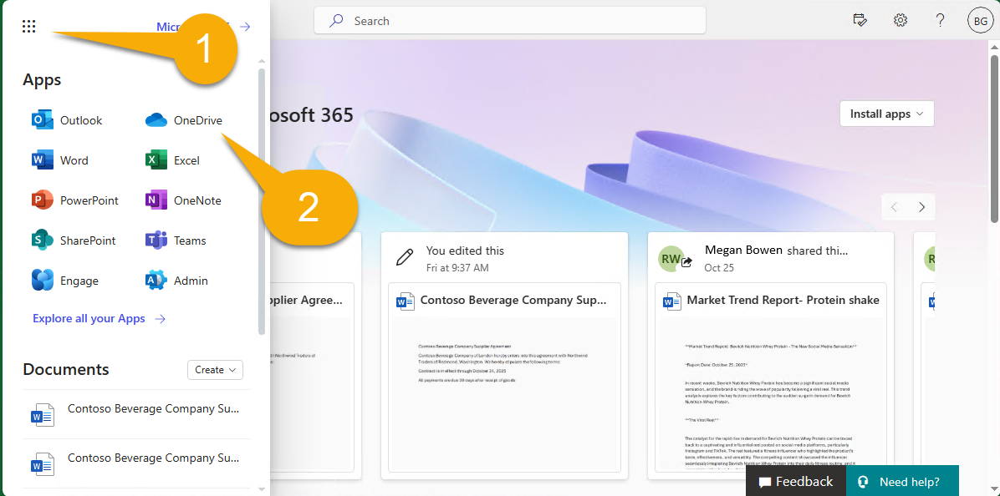
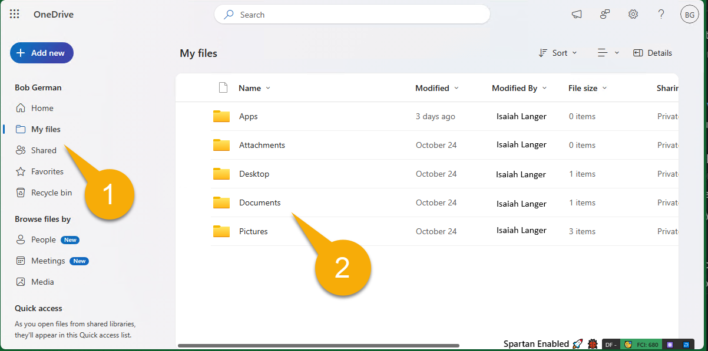

---
lab:
  title: 准备开发环境
  module: 'LAB 02: Build your own message extension plugin with TypeScript (TS) for Microsoft Copilot'
---

# 准备开发环境

首先，让我们准备好开发环境、帐户和软件。 在开始之前，必须先完成以下任务。

## 任务 1 - 安装必备组件

> [!IMPORTANT]
> 若要成功完成此项目，需要具有上传应用程序权限的 Microsoft 365 帐户。 若要完成**练习 2**，该帐户还必须获得适用于 Microsoft 365 的 Microsoft Copilot 的许可。

如果使用的是新租户，最好在开始前先登录 [Microsoft 365 页面](https://office.com)，网址为 [https://office.com](https://office.com)。 根据租户的配置方式，可能会要求你设置多重身份验证。 在继续操作之前，请确保可以访问 Microsoft Teams 和 Microsoft Outlook。

以下工具已经安装在 **MS-4010-CLIENT01** 实验室中。 请确保它们已安装并可操作：

1. [Visual Studio Code](https://code.visualstudio.com/)（最新版本）

1. [Azure 存储资源管理器](https://azure.microsoft.com/products/storage/storage-explorer/) - 如果要查看和编辑此示例中使用的 Northwind 数据库，请下载此项。

<!--## Task 2 - Install nvm-windows

You'll use this tool to install Node.js and optionally switch Node versions as needed for your projects.

1. In a web browser, navigate to [https://github.com/coreybutler/nvm-windows/releases](https://github.com/coreybutler/nvm-windows/releases).
2. Locate the latest release version and select the **nvm-setup.zip** file to download.  The file will be downloaded to your machine.
3. Open the file folder and **extract** the contents of the zip folder to a folder on your machine.
4. From the new folder, select **nvm-setup.exe** to open the setup file.
5. Follow the prompts in the installer to install the tool using the default options.
6. Nvm for Windows will be installed on your machine.

## Task 3 - Install Node.js

Install Node.js version 18.18.2, which is compatible with all of the solutions in this course.

1. Open the **Command Prompt** application.
2. Enter the command `nvm install 18.18` to install Node.js.
3. The nvm output should confirm that installation is complete.
4. Run the command `nvm use 18.18` to use this version of Node.js.
5. Run the command `node -v` to confirm that you have version 18.18.2 installed.

You have now installed and configured Node.js version 18.18.2-->

## 任务 2 - 下载示例代码

将示例存储库[下载](https://github.com/OfficeDev/Copilot-for-M365-Plugins-Samples/) 为 ZIP 文件，并将其解压缩到 **Documents 文件夹**：

```text
https://github.com/OfficeDev/Copilot-for-M365-Plugins-Samples/
```

在该目录中，导航到 **samples/msgext-northwind-inventory-ts** 文件夹。 这些实验室将它称为“**工作文件夹**”，因为这将是你工作的地方。

## 任务 3 - 将示例文档复制到 OneDrive

示例应用程序包括一些文档，供 Copilot 在实验室期间引用。 在此任务中，你将这些文件复制到用户的 OneDrive，以便 Copilot 可以找到这些文件。 根据租户的设置方式，可能会要求你在此过程中设置多重身份验证。

1. 打开浏览器，浏览 Microsoft 365 ([https://www.office.com/](https://www.office.com/))。 使用你将在整个实验室中使用的 Microsoft 365 帐户登录。 可能会要求你设置多重身份验证。

1. 使用页面左上角的应用菜单1️⃣，导航到 Microsoft 365 中的 OneDrive 应用程序2️⃣。

    

1. 在 OneDrive 中，导航到 **“我的文件”** 1️⃣。 如果有文档文件夹，也可以导航到该文件夹。 否则，可以直接在**我的文件**位置中进行操作。

    

1. 现在，选择“**“添加新的”** 1️⃣和 **“文件夹”** 2️⃣，以创建新文件夹。

    

1. 将文件夹命名为 **Northwind 合同**，然后选择“创建”****。

    

1. 现在，从此新文件夹中，再次选择“新增“**** 1️⃣，但这次选择“文件上传”**** 2️⃣。

    

1. 现在，浏览到**工作文件夹**中的 **sampleDocs** 文件夹。 突出显示所有文件 1️⃣，然后选择**确定** 2️⃣，以上传所有这些文件。

    

尽早完成此任务，在你准备好它们时，Microsoft 365 搜索引擎很有可能会发现它们。

## 任务 4 - 为 Visual Studio Code 配置 Teams 工具包

在此任务中，你将安装[适用于 Visual Studio Code 的 Teams 工具包](https://learn.microsoft.com/microsoftteams/platform/toolkit/teams-toolkit-fundamentals?pivots=visual-studio-code-v5)的当前版本。 执行此操作的最简单方法是在 Visual Studio Code 中直接执行此操作。

1. 在 Visual Studio Code 中打开**工作文件夹**。 系统可能会要求你信任此文件夹的作者；如果是，请信任作者。 在 **Visual Studio Code 文件菜单**中，选择**打开文件夹**，然后直接打开 **msgext-northwind-inventory-ts** 文件夹。

1. 现在，选择左侧的 **Teams 工具包** 图标 1️⃣。 如果它提供了创建新项目的选项，则可能位于错误的文件夹中。  应会看到帐户、环境等部分，如下所示。

1. 在“帐户”**** 下，选择“登录到 Microsoft 365”**** 2️⃣，然后使用 Microsoft 365 帐户登录。

    

1. 浏览器窗口将打开，可以登录到 Microsoft 365。 当显示**现在登录并关闭此页面**时，请执行此操作。

1. 最后，验证“已启用的自定义应用上传”**** 旁边是否显示绿色复选标记。 否则，这意味着用户帐户无权上传 Teams 应用程序。 默认情况下，此权限处于“关闭”状态；下面是[允许用户上传自定义应用的说明](https://learn.microsoft.com/microsoftteams/teams-custom-app-policies-and-settings#allow-users-to-upload-custom-apps)

    

## 检查你的工作

完成上述所有任务后，应安装以下内容并将其下载到计算机：

- [Visual Studio Code](https://code.visualstudio.com/)（最新版本）

- [NodeJS 版本 18.x](https://nodejs.org/download/release/v18.18.2/)

- [Azure 存储资源管理器](https://azure.microsoft.com/products/storage/storage-explorer/)（可选）

- [适用于 Visual Studio Code 的 Teams 工具包](https://learn.microsoft.com/microsoftteams/platform/toolkit/teams-toolkit-fundamentals?pivots=visual-studio-code-v5)

- 示例存储库：[https://github.com/OfficeDev/Copilot-for-M365-Plugins-Samples/](https://github.com/OfficeDev/Copilot-for-M365-Plugins-Samples/)

如果一切准备就绪，现在可以将示例应用程序作为消息扩展运行。 

[继续进行下一个练习......](./3-exercise-1-run-message-extension.md)