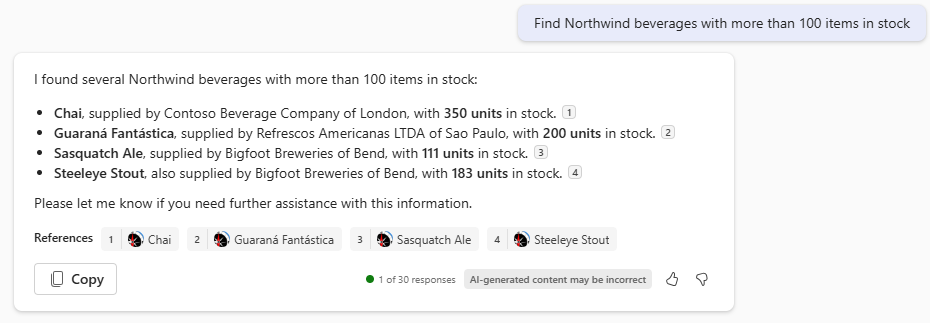

---
lab:
  title: 练习 2 - 以 Copilot 插件的形式运行示例
  module: 'LAB 02: Build your own message extension plugin with TypeScript (TS) for Microsoft 365 Copilot'
---

# 练习 2 - 以 Copilot 插件的形式运行示例

在本练习中，将应用程序作为 Microsoft 365 Copilot 的插件运行。 你将尝试各种提示，并观察如何使用不同的参数调用插件。

> [!NOTE]  
> 若要执行以下练习，帐户必须具有 Microsoft 365 Copilot 的有效许可证。

## 任务 1 - 在 Microsoft 365 Copilot 中进行测试（单个参数）

1. 在左侧的应用程序栏上，选择 **Copilot** 应用。

1. 在撰写框的右侧，选择**插件**图标 1️⃣，并启用 **Northwind 库存**插件 2️⃣。

    

1. 为获得最佳结果，请在每个提示或相关提示集之前，选择 右上角的**新建聊天**图标。

    

1. 请尝试以下仅使用消息扩展的单个参数的提示：

    - _在 Northwind 库存中查找有关 Chai 的信息。_

    - _在 Northwind 找到折扣海鲜。显示包含产品、供应商名称、平均折扣率和每个周期收入的表。_

最后一项应引用上传到 OneDrive 的文档。 测试时，请观看 Visual Studio Code 中的日志消息。 应该能够查看 Copilot 何时调用插件并提交查询。 例如，在请求**折扣海鲜产品**后，Copilot 使用 `discountSearch` 命令发出此查询。


可能会在 3 种窗体中看到 Northwind 数据的引文。 如果有单个引用，Copilot 可能会显示整个卡片。


如果有多个引用，Copilot 可能会在每个引用旁边显示一个小的数字。 可以将鼠标悬停在这些数字上以显示自适应卡片。 响应下方还会列出引用。


尝试这些自适应卡片对产品执行操作。 请注意，这不会影响 Copilot 的早期响应。

可以随意尝试编写自己的提示。 你会发现，仅当 Copilot 能够查询插件以获取所需信息时，它们才起作用。 这强调了需要预测用户将发出的提示类型，并为每个提示提供相应的查询类型。 具有多个参数将使此功能更加强大！

## 任务 2 - 在 Microsoft 365 Copilot 中进行测试（多个参数）

在本练习中，你将尝试一些在示例插件中练习多参数功能的提示。 这些提示将请求按**应用清单**中定义的**名称**、**类别**、**库存状态**、**供应商城市**和**库存级别**检索的数据。

例如，尝试提示 **_查找库存超过 100 件的 Northwind 饮料_**。 若要生成响应，Copilot 必须识别产品：

- 其中类别为**饮料**。
  
  _AND_

- 其中库存状态为**有库存**。

  _AND_

- 其中**库存水平**大于 **100**。

如果查看日志文件，可以看到 Copilot 能够理解此要求，并在第一个消息扩展命令中填写 3 个参数。


插件代码应用所有三个筛选器，提供仅 4 个产品的结果集。 Copilot 使用生成的自适应卡片上的信息，呈现与此类似结果：



有了此提示，Copilot 可能还会在 OneDrive 文件中查找每个供应商合同的付款方式。 在这种情况下，你会注意到某些引用不会有 **Northwind Inventory** 图标，但有 **Word** 图标。


下面还有一些提示可供尝试：

- _查找库存不足的 Northwind 乳制品。向我显示一个包含产品、供应商、库存数量和已订购数量的表格。_

- _我们一直收到豆腐的部分订单。在 Northwind 中找到供应商，并起草一封电子邮件，汇总我们的库存情况，并提醒他们应该根据我们的 MOQ 政策停止发送部分订单。_

- _Northwind 将在伦敦 Microsoft 社区日设立一个展位。搜寻当地供应商的产品，并撰写 LinkedIn 帖子来推广展位和产品。强调产品的美味，并鼓励人们参观我们的展位。_

- _哪些饮料因社交媒体的影响而需求量大，但在伦敦的 Northwind 中却库存不足。请参考产品详细信息更新库存。_

哪些提示最适合你？ 尝试创建自己的提示并观察日志消息，以了解 Copilot 如何访问插件。

### 故障排除提示

如果在测试插件时遇到挑战，可以启用**开发人员模式**。 开发人员模式提供有关 Copilot 业务流程协调程序所选插件的信息，以响应提示。 它还显示插件中的可用功能和 API 调用的状态代码。

若要启用开发人员模式，请在 Copilot 中键入以下内容：

```console
-developer on
```

执行提示和开发人员模式将输出类似于以下内容的结果： 


如你所见，在 Copilot 生成的响应下方有一个表格，为我们提供了有关幕后所发生事情的富有洞察力的信息：

- 在**已启用的插件**下，可以看到 Copilot 已识别出 Northwind Inventory 插件已启用。

- 在**匹配的功能**下，可以看到 Copilot 已确定 Northwind 库存插件提供三个功能：`inventorySearch`、`discountSearch` 和 `companySearch`。

- 在**已选执行的功能**下，可以看到 Copilot 已选择 `inventorySearch` 功能来响应提示。

- 在**功能执行详细信息**下，可以看到有关执行的一些详细信息，例如插件返回给 Copilot 引擎的 HTTP 响应。

## 检查你的工作

完成本练习中的任务后，你应该能够在 Microsoft 365 Copilot 中使用 **Northwind Inventory** 插件。 

完成该练习后，即可向消息扩展添加新命令，以便扩展插件功能并执行更多任务。 

[继续下一个练习...](./5-exercise-3-add-new-command.md)
