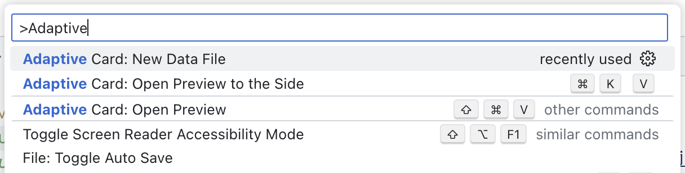
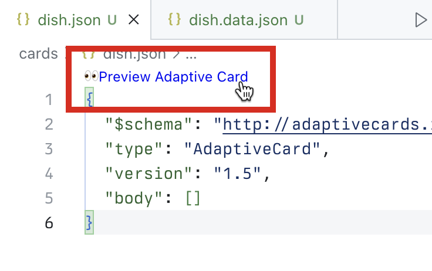

---
lab:
  title: 练习 1 - 下载项目并生成自适应卡片
  module: 'LAB 03: Use Adaptive Cards to show data in API plugins for declarative agents'
---

# 练习 1 - 下载项目并生成自适应卡片

首先，为代理生成自适应卡片模板，以在其响应中显示数据。 要生成自适应卡片模板，请使用自适应卡片预览器 Visual Studio Code 扩展，在 Visual Studio Code 中直接预览你的工作。 使用扩展，我可以生成自适应卡片模板，且其中包含对数据的引用。 在运行时，代理使用从 API 检索的数据填充占位符。

### 练习用时

- **估计完成时间：** 10 分钟

## 任务 1 - 下载初学者项目

首先下载示例项目。 在 Web 浏览器中：

1. 导航到 [https://github.com/microsoft/learn-declarative-agent-api-plugin-adaptive-cards-typescript](https://github.com/microsoft/learn-declarative-agent-api-plugin-adaptive-cards-typescript)。
  1. 按照步骤，[将存储库源代码下载](https://docs.github.com/repositories/working-with-files/using-files/downloading-source-code-archives#downloading-source-code-archives-from-the-repository-view)到计算机。
  1. 将下载的 zip 文件的内容解压缩到 **Documents 文件夹**。
  1. 在 Visual Studio Code 中打开  文件夹，

示例项目是一个 Teams 工具包项目，其中包含使用 API 插件生成的操作的声明性代理。 API 插件连接到在 Azure Functions 上运行的匿名 API，也包含在项目中。 API 属于虚构的意大利餐厅，允许浏览今天的菜单并下订单。

## 任务 2 - 为菜肴生成自适应卡片

首先，创建一个自适应卡片，用于显示有关单个菜肴的信息。

在 Visual Studio Code 中：

1. 在“**资源管理器**”视图中，创建一个名为 **cards** 的新文件夹。
1. 在 **cards** 文件夹中，创建名为 **dish.json** 的新文件。 粘贴表示空自适应卡片的内容：

  ```json
  {
    "$schema": "http://adaptivecards.io/schemas/adaptive-card.json",
    "type": "AdaptiveCard",
    "version": "1.5",
    "body": []
  }
  ```

1. 在继续之前，在活动栏的“**扩展**”选项卡中，搜索并安装“**自适应卡片预览器**”扩展，然后为自适应卡片创建数据文件：
  1. 按键盘上的 <kbd>CTRL</kbd>+<kbd>P</kbd> 键，打开命令面板。 键入 `>Adaptive` 以查找与使用自适应卡片相关的命令。

    

  1. 从列表中选择“**自适应卡片：新建数据文件**”。 在 Visual Studio Code 中，创建名为 **dish.data.json** 的新文件。
  1. 将其内容替换为表示菜肴的数据：

  ```json
  {
    "id": 4,
    "name": "Caprese Salad",
    "description": "Juicy vine-ripened tomatoes, fresh mozzarella, and fragrant basil leaves, drizzled with extra virgin olive oil and a touch of balsamic.",
    "image_url": "https://raw.githubusercontent.com/pnp/copilot-pro-dev-samples/main/samples/da-ristorante-api/assets/caprese_salad.jpeg",
    "price": 10.5,
    "allergens": [
    "dairy"
    ],
    "course": "lunch",
    "type": "dish"
  }
  ```

  1. 保存所做的更改
1. 返回到 **dish.json** 文件。
1. 从可重用功能区中选择“**预览自适应卡片**”。

  

  Visual Studio Code 将卡片预览打开到一侧。 编辑卡片时，更改将立即显示在一侧。

1. 向 **body** 数组添加一个“**容器**”元素，其中包含对存储在 **image_url** 属性中的图像 URL 的引用。

  ```json
  {
    "type": "Container",
    "items": [
    {
      "type": "Image",
      "url": "${image_url}",
      "size": "large"
    }
    ]
  }
  ```

  请注意卡片预览如何自动更新以显示卡片：

  

1. 添加对其他菜肴属性的引用。 完整的卡片如下所示：

  ```json
  {
    "$schema": "http://adaptivecards.io/schemas/adaptive-card.json",
    "type": "AdaptiveCard",
    "version": "1.5",
    "body": [
    {
      "type": "Container",
      "items": [
      {
        "type": "Image",
        "url": "${image_url}",
        "size": "large"
      },
      {
        "type": "TextBlock",
        "text": "${name}",
        "weight": "Bolder"
      },
      {
        "type": "TextBlock",
        "text": "${description}",
        "wrap": true
      },
      {
        "type": "TextBlock",
        "text": "Allergens: ${if(count(allergens) > 0, join(allergens, ', '), 'none')}",
        "weight": "Lighter"
      },
      {
        "type": "TextBlock",
        "text": "**Price:** €${formatNumber(price, 2)}",
        "weight": "Lighter",
        "spacing": "None"
      }
      ]
    }
    ]
  }
  ```

  

  请注意，若要显示过敏原，请使用函数将过敏原联接到字符串中。 如果菜肴没有过敏原，则显示**无**。 为了确保正确设置价格格式，请使用 **formatNumber** 函数，该函数允许我们指定要在卡片上显示的十进制数。

## 任务 3 - 为订单摘要生成自适应卡片

示例 API 允许用户浏览菜单并下订单。 让我们创建一个显示订单摘要的自适应卡片。

在 Visual Studio Code 中：

1. 在“**卡片**”文件夹中，新建名为 **order.json** 的文件。 粘贴表示空自适应卡片的内容：

  ```json
  {
    "$schema": "http://adaptivecards.io/schemas/adaptive-card.json",
    "type": "AdaptiveCard",
    "version": "1.5",
    "body": []
  }
  ```

1. 为自适应卡片创建数据文件：
  1. 按键盘上的 <kbd>CTRL</kbd>+<kbd>P</kbd>（在 macOS 上按 <kbd>CMD</kbd>+<kbd>P</kbd>）打开命令面板。 键入`>Adaptive`以查找与使用自适应卡片相关的命令。

    

  1. 从列表中选择“**自适应卡片：新建数据文件**”。 Visual Studio Code 新建名为 **order.data.json** 的文件。
  1. 将其内容替换为表示订单摘要的数据：

    ```json
    {
      "order_id": 6210,
      "status": "confirmed",
      "total_price": 25.48
    }
    ```

  1. 保存所做的更改
1. 返回到 **order.json** 文件。
1. 从可重用功能区中选择“**预览自适应卡片**”。
1. 接下来，将 **order.json** 文件的内容替换为以下代码：

  ```json
  {
    "$schema": "http://adaptivecards.io/schemas/adaptive-card.json",
    "type": "AdaptiveCard",
    "version": "1.5",
    "body": [
    {
      "type": "TextBlock",
      "text": "Order Confirmation 🤌",
      "size": "Large",
      "weight": "Bolder",
      "horizontalAlignment": "Center"
    },
    {
      "type": "Container",
      "items": [
      {
        "type": "TextBlock",
        "text": "Your order has been successfully placed!",
        "weight": "Bolder",
        "spacing": "Small"
      },
      {
        "type": "FactSet",
        "facts": [
        {
          "title": "Order ID:",
          "value": "${order_id} "
        },
        {
          "title": "Status:",
          "value": "${status}"
        },
        {
          "title": "Total Price:",
          "value": "€${formatNumber(total_price, 2)}"
        }
        ]
      }
      ]
    }
    ]
  }
  ```

  与上一部分一样，将卡片上的每个元素映射到 data 属性。

  

  > [!IMPORTANT]
  > 请注意 **${order_id}** 后面的尾随空格。 这是有意为之，因为自适应卡片呈现数字存在已知问题。 要对其进行测试，请移除空格，并查看数字是否从预览中消失。
  >
  > 

  还原尾随空格，以便卡片正确显示并保存更改。