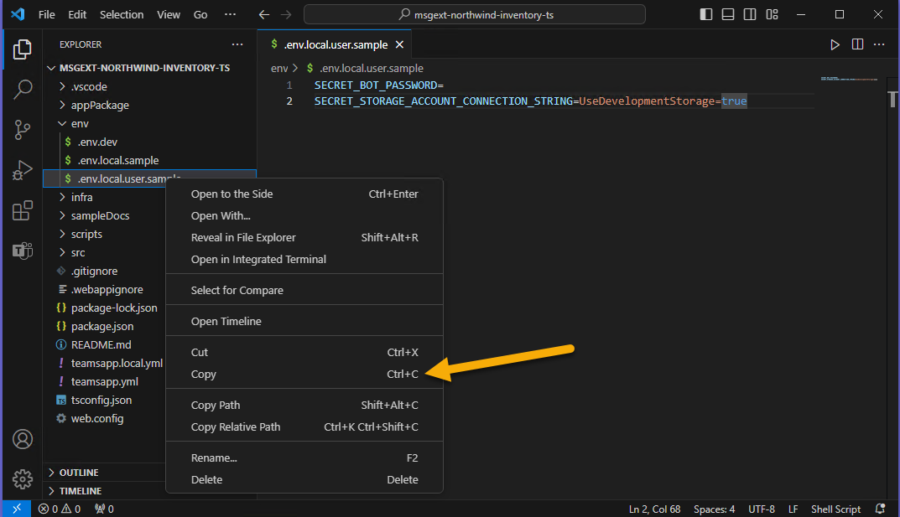
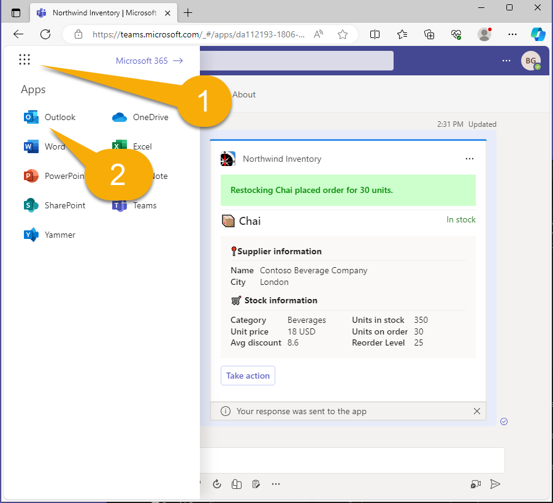

---
lab:
  title: 练习 1 - 将示例作为消息扩展运行
  module: 'LAB 03: Build your own message extension plugin with TypeScript (TS) for Microsoft Copilot'
---

# 练习 1 - 将示例作为消息扩展运行

在本练习中，你将把应用程序作为 Teams 和 Outlook 的插件运行。 你将尝试各种提示，并观察如何使用不同的参数调用插件。

## 任务 1 - 设置项目以供首次使用

在此项目中，Northwind 数据库存储在 Azure 表存储中；在本地调试时，它使用 [Azurite](https://learn.microsoft.com/azure/storage/common/storage-use-azurite?tabs=visual-studio) 存储模拟器。 这主要内置于项目中，但除非提供连接字符串，否则项目就不会生成。

Teams 工具包将环境变量存储在 **env** 文件夹中，并在首次启动项目时自动填写所有值。 但是，有一个特定于示例应用程序的值，那就是用于访问 Northwind 数据库的连接字符串。 文件 **env/.env.local.user.sample** 中提供了必要的设置。 

在 **env** 文件夹中复制此文件，并将其命名为 **.env.local.user**。 这是存储机密或敏感设置的位置。

如果不确定如何在 Visual Studio Code 中执行此操作： 

1. 展开 **env** 文件夹，右键单击 **.env.local.user.sample**。 选择“复制”。**** 

1. 然后右键单击 **env** 文件夹中的任意位置并选择**粘贴**。 你将拥有一个名为 **.env.local.user copy.sample** 的新文件。 

1. 使用相同的上下文菜单将文件重命名为 **.env.local.user** 即可完成。

    

生成的 **.env.local.user** 文件应包含以下行：

```console
SECRET_STORAGE_ACCOUNT_CONNECTION_STRING=UseDevelopmentStorage=true
```

## 任务 2 - 在本地运行应用程序

1. 在 Visual Studio Code 中打开了**工作文件夹**时，按 **F5** 开始调试，或选择“开始”按钮 1️⃣。 

1. 选择**在 Teams (Edge) 中调试** 2️⃣。

    

    首次运行应用时，系统可能会提示你允许 NodeJS 通过防火墙；这是允许应用程序通信所必需的。

    第一次加载所有 npm 包时，可能会需要一段时间。 最终，浏览器窗口将打开并邀请你登录。

    

    登录后，Microsoft Teams 应打开并显示一个对话框，提供安装应用程序的选项。 观察显示的信息；这些信息来源于**应用清单**。

1. 选择**添加**，以将 Northwind Inventory 添加为个人应用程序。

    

> [!NOTE]
> 如果看到此屏幕，则需要修复 **env/.env.local.user** 文件；上一任务对此进行了说明。
>
> 

应定向到应用程序中的聊天，但你可以在任何聊天中使用该应用。

## 任务 3 - 在 Microsoft Teams 中进行测试

1. 在 **Northwind Inventory 聊天**中 - 开始键入提及产品的消息 1️⃣。 然后，若要插入产品的自适应卡片，请选择 **+** 2️⃣。 

1. 在浮出控件中，选择刚刚安装的 **Northwind Inventory** 应用程序 3️⃣。

    

  你将看到一个搜索对话框，其中包含 3 个选项卡 1️⃣。 **产品清单**选项卡允许按名称搜索产品。

1. 在搜索框 2️⃣ 中键入产品名称或产品名称的开头（如 **chai**）。 如果在键入第一个字母时暂停，你将获得更多以相同字符开头的产品选择。

1. 选择 **Chai** 3️⃣，将自适应卡片与你的评论一起插入对话中。

    

1. 可以看到卡片，但在发送卡片之前无法使用它。 对消息进行任何最终编辑，然后选择**发送**。 请注意，没有已订购的茶 1️⃣。 我们肯定有一些经常喝茶的人，他们可能会顺道过来，所以你最好多订购一些！ 

    

    > [!NOTE]
    > 在发送卡片之前，自适应卡片操作不会生效。 如果出现错误，请检查并确保你已发送消息，并在发送后使用该卡。

1. 选择**执行操作**按钮 2️⃣，以打开子卡。 输入数量 3️⃣，然后选择**补货**按钮 4️⃣。 卡片将刷新，显示成功消息和已更新的订购数量。

    

可以使用其他两个按钮取消订单或修改库存水平。

## 任务 4 - 高级查询

返回 Visual Studio Code，在 **appPackage** 目录中打开名为 **manifest.json** 的应用清单文件。 你会注意到安装应用时显示的应用信息已全部在此处。 向下滚动并查找 `composeExtensions:`。 

```json
"composeExtensions": [
    {
        "botId": "${{BOT_ID}}",
        "commands": [
            {
                "id": "inventorySearch",
                ...
                "description": "Search products by name, category, inventory status, supplier location, stock level",
                "title": "Product inventory",
                "type": "query",
                "parameters": [ ... ]
            },
            {
                "id": "discountSearch",
                ...
                "description": "Search for discounted products by category",
                "title": "Discounts",
                "type": "query",
                "parameters": [ ...]
            }
        ]
    }
],
```

> [!NOTE]
> 撰写扩展是消息扩展的历史名称；此处定义了 Northwind Inventory 消息扩展。

首先，请注意由 Microsoft Teams 预配的**机器人 ID**，该 ID 使用 Azure 机器人通道与应用程序交换安全的实时消息。 Teams 工具包将注册机器人并填写 ID。

接下来，观察命令的集合。 这些对应于 Teams 中搜索对话框中的选项卡。 在此应用程序中，命令主要针对 Copilot，而非普通用户！

按名称搜索产品时，已运行第一个命令。 若要尝试其他命令，请在**折扣**选项卡中输入**饮料**、**乳制品**或**农产品**，你将看到这些类别中的折扣产品。 Copilot 可以使用查询来回答有关折扣产品的问题。


现在再次检查第一个命令。 你会注意到它有 5 个参数！

```json
"parameters": [
    {
        "name": "productName",
        "title": "Product name",
        "description": "Enter a product name here",
        "inputType": "text"
    },
    {
        "name": "categoryName",
        "title": "Category name",
        "description": "Enter the category of the product",
        "inputType": "text"
    },
    {
        "name": "inventoryStatus",
        "title": "Inventory status",
        "description": "Enter what status of the product inventory. Possible values are 'in stock', 'low stock', 'on order', or 'out of stock'",
        "inputType": "text"
    },
    {
        "name": "supplierCity",
        "title": "Supplier city",
        "description": "Enter the supplier city of product",
        "inputType": "text"
    },
    {
        "name": "stockQuery",
        "title": "Stock level",
        "description": "Enter a range of integers such as 0-42 or 100- (for >100 items). Only use if you need an exact numeric range.",
        "inputType": "text"
    }
]
```

虽然 Teams 只能显示第一个参数；Copilot 可以使用所有 5 个参数，从而能够对 Northwind 库存数据执行更高级的查询。 作为 Teams UI 限制的解决方法，**Northwind Inventory** 选项卡将接受最多 5 个逗号分隔的参数，采用以下格式：

```console
name,category,inventoryStatus,supplierCity,supplierName
```


输入查询时，请仔细阅读上述 JSON 中的说明。 尝试输入下面列出的术语，在输入过程中，请留意 Visual Studio Code 中的调试控制台选项卡，你将在其中看到每个查询的运行情况。

- **_chai_** - 查找名称以 **chai** 开头的产品。

- **_c,bev_** - 查找以 **bev** 开头的类别中的产品和名称以 **c** 开头的产品。

- **_,,out_** - 查找缺货的产品。

- **_,,on,London_** - 查找从伦敦供应商处订购的产品。

- **_tofu,produce,,Osaka_** - 查找 **“农产品”** 类别中供应商位于 **Osaka** 且名称以 **tofu** 开头的产品。

每个查询词都会向下筛选产品列表。 每个查询词的格式都是任意的 - 只需确保在每个参数的说明中向 Copilot 解释即可。

## 任务 5 - 在 Microsoft Outlook 中进行测试

让我们简单介绍一下，以便你了解消息扩展在 Microsoft Outlook 中的工作方式。

1. 首先，打开 Microsoft 365 应用菜单 1️⃣，然后选择 **Outlook** 2️⃣。

    

1. 选择 **“新建邮件”**，以开始撰写电子邮件。

    

1. 添加**收件人** 1️⃣ 和**主题** 2️⃣，然后将光标置于邮件正文 3️⃣。 甚至可以键入内容。 准备就绪后，选择工具栏 4️⃣ 中的**应用按钮**。

    

1. 选择 **Northwind Inventory** 应用程序，根据需要进行搜索以查找它。

    

1. 像之前一样搜索 **Chai** 1️⃣，并选择结果以插入自适应卡片 2️⃣。

    

    

> [!NOTE]
> 在发送消息之前，自适应卡片不会生效。 如果收件人不使用 Microsoft Outlook，则无法查看卡片，如果他们没有安装 Northwind Inventory 应用，则无法对卡片执行操作。

## 任务 6 - 在 Azure 存储资源管理器中查看 Northwind 数据库

Northwind 数据库并不花哨，但它是真实的！ 如果要查看甚至修改数据：

1. 在 Azurite 运行时打开 [Azure 存储资源管理器](https://azure.microsoft.com/products/storage/storage-explorer/)（运行应用自动启动 Azurite）。

1. 打开**模拟器和附加设备**、**存储帐户**、**模拟器 - 默认端口**和**表**，以查看 Northwind 数据。

    

该代码读取每个查询上的**产品**表，但仅在应用启动时访问其他表。 因此，如果要添加新类别，则需要重启应用才能使其显示。

## 检查工作

完成本练习中的所有任务后，你应该有一个可运行的消息扩展应用程序，可用作适用于 Teams 或 Outlook 的 Microsoft 365 插件。

一切正常时，即可在适用于 **Microsoft 365 的 Microsoft Copilot** 中运行示例应用程序！ 

[继续下一个练习...](./4-exercise-2-run-copilot-plugin.md)
