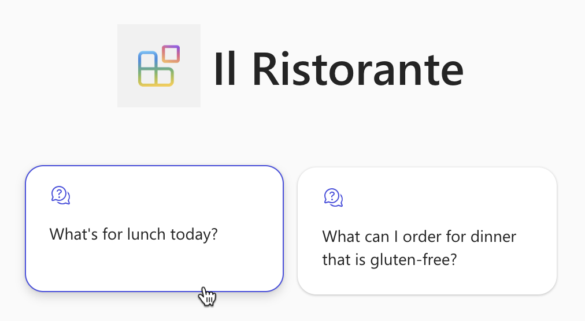

---
lab:
  title: 练习 3 - 在 Microsoft 365 Copilot 中使用 API 插件测试声明性代理
  module: 'LAB 03: Use Adaptive Cards to show data in API plugins for declarative agents'
---

# 练习 3 - 在 Microsoft 365 Copilot 中使用 API 插件测试声明性代理

最后一步是在 Microsoft 365 Copilot 中使用 API 插件测试声明性代理。

### 练习用时

- **估计完成时间：** 10 分钟

## 任务 1 - 预配和开始调试

在 Visual Studio Code 中：

1. 从**活动栏**中，选择 **Teams 工具包**。
1. 在“**帐户**”部分中，确保使用 Microsoft 365 Copilot 登录到 Microsoft 365 租户。

    

1. 从**活动栏**中，选择“**运行和调试**”。
1. 选择“**Copilot 中的调试**”配置，然后使用“**开始调试**”按钮开始调试。  

    

1. Visual Studio Code 生成项目并将其部署到 Microsoft 365 租户，并打开一个新的 Web 浏览器窗口。

## 任务 2 - 运行测试并查看结果

在 Web 浏览器中：

1. 出现提示时，请使用 Microsoft 365 Copilot 登录到属于 Microsoft 365 租户的帐户。
1. 从侧边栏中，选择“**Il Ristorante**”。

    

1. 选择“**今天午餐吃什么？**”对话开场白并提交提示。

    

1. 出现提示时，检查代理发送到 API 的数据，并使用“**允许一次**”按钮进行确认。

    

1. 等待代理响应。 请注意，引文上的弹出窗口现在包含自定义自适应卡片，其中包含来自 API 的其他信息。

    

1. 下订单，在提示文本框中输入：**1 份意大利面、1 份冰茶**，然后提交提示。
1. 检查代理发送到 API 的数据，继续使用“**确认**”按钮。

    

1. 等待代理下订单并返回订单摘要。 请注意，由于 API 返回单个项，代理使用自适应卡片呈现它，并直接在其响应中包含卡片。

    

1. 返回 Visual Studio Code 并停止调试。
1. 切换到“**终端**”选项卡并关闭所有活动终端。

    
