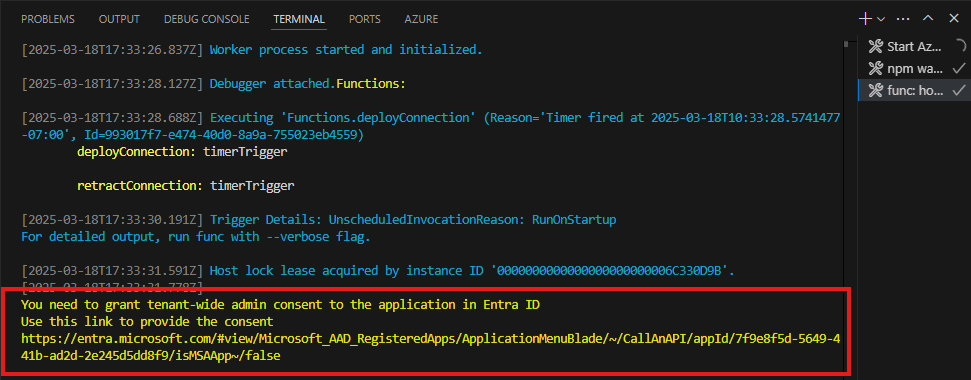

---
lab:
  title: 练习 1 - 为 Graph 连接器创建外部连接
  module: 'LAB 04: Add custom knowledge to declarative agents using Microsoft Graph connectors and Visual Studio Code'
---

# 练习 1 - 为 Graph 连接器创建外部连接

扩展具有知识的声明性代理可以访问不属于其大型语言模型的其他信息。 使用 Graph 连接器，可以将外部数据引入到 Microsoft 365，其中可用于不同的用户体验，包括智能 Microsoft 365 Copilot 副驾驶®。 配置 Copilot 代理的知识设置时，可以将它与 Graph 连接器创建的外部连接集成。

### 练习用时

- **估计完成时间：** 10 分钟

## 任务 1 - 下载示例项目并连接到资源

将 Copilot 代理与 Graph 连接器集成时，需要指定连接器创建的外部连接的 ID。 通常，将 Graph 连接器与 Copilot 代理分开部署。 若要完成本练习，请部署在后续步骤中引用的现有 Graph 连接器。

首先下载 Graph 连接器示例项目。

1. 在网页浏览器中，导航到 [https://aka.ms/learn-gc-ts-policies](https://aka.ms/learn-gc-ts-policies)。 系统会提示使用示例项目下载 ZIP 文件。
1. 将该 zip 文件保存在计算机上。
    1. 在“**文档**”中创建新文件夹。
    1. 将下载的 zip 文件的内容提取到刚刚创建的文件夹。
    1. 在 Visual Studio Code 中打开  文件夹，

在 Visual Studio Code 中：

1. 在“文件”菜单中，选择“**打开文件夹...**”选项。
1. 打开刚刚提取到 **Documents 文件夹**的 project 文件夹。
1. 在“**活动栏**”（边栏）中，打开“**Teams 工具包**”扩展。
1. 在“**帐户**”窗格中，确认已连接到 **Microsoft 365 租户**。
1. 在“**帐户**”窗格中，确认已连接到 **Azure 订阅**。

    

> [!NOTE]
> 如果你没有完全 Microsoft 365 Copilot 许可证，你可能会看到“Copilot 访问已禁用”。 练习仍然可以完成，尽管你可能无法在智能 Microsoft 365 Copilot 副驾驶® 对话助手中完全测试代理。

## 任务 2 - 运行项目并创建与 Microsoft 365 的连接

1. 按 <kbd>F5</kbd> 运行项目。 Teams 工具包在租户中创建新的 Microsoft Entra 应用注册，使 Graph 连接器能够与 Microsoft 365 租户通信。 Teams 工具包还会启动托管 Graph 连接器的计时器触发的 Azure 函数。

> [!IMPORTANT]
> 此步骤最多可能需要 10 分钟或更长的时间才能完成，在完成练习之前不要关闭。

1. 在 Graph 连接器可以运行之前，需要同意 Entra 应用所需的权限。 若要授予许可，请使用与 **func：主机启动**任务关联的**终端**窗格中的说明。

    

1. 在 Web 浏览器中打开同意 URL。 使用属于 Microsoft 365 租户的工作帐户登录。 使用“**授予管理员同意**”按钮向应用授予所需的权限。

    

1. 授予对所需权限的同意后，Graph 连接器将继续。 在“**终端**”窗格中，注意 Graph 连接器的输出。 Graph 连接器创建外部连接、预配架构并将示例内容引入 Microsoft 365 租户。
1. 运行连接器需要 5-10 分钟才能完成。 完成后，通过按调试工具栏中的“**停止**”按钮，停止调试。

    
