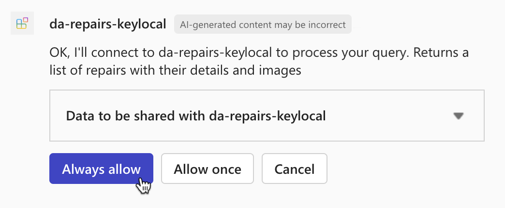

---
lab:
  title: 练习 2 - 在 Microsoft 365 Copilot Chat 中测试声明性代理
  module: 'LAB 05: Authenticate your API plugin for declarative agents with secured APIs'
---

# 练习 2 - 在 Microsoft 365 Copilot Chat 中测试声明性代理

在本练习中，你将测试声明性代理并将其部署到 Microsoft 365，并使用 Microsoft 365 Copilot Chat 对其进行测试。

### 练习用时

- **估计完成时间：** 10 分钟

## 任务 1 - 在 Microsoft 365 Copilot Chat 中使用 API 插件测试声明性代理

最后一步是在智能 Microsoft 365 Copilot 副驾驶® 中使用 API 插件测试声明性代理。

在 Visual Studio Code 中：

1. 在活动栏中，打开“**Teams 工具包**”扩展。
1. 在“**Teams 工具包**”扩展面板中的“**帐户**”部分中，确保已登录到 Microsoft 365 租户。

  

1. 在“活动栏”中，切换到“运行和调试”视图。
1. 在配置列表中，选择 **Copilot (Edge) 中的“调试”**，然后按播放按钮开始调试。

  

  Visual Studio Code 使用智能 Microsoft 365 Copilot 副驾驶® 对话助手打开新的 Web 浏览器。 如果系统提示登录，请使用 Microsoft 365 帐户登录。

在 Web 浏览器中：

1. 在侧面板中，选择 **da-repairs-keylocal** 代理。

  

1. 在提示文本框中，键入`What repairs are assigned to Karin?`，然后提交提示。
1. 确认要使用“**始终允许**”按钮将数据发送到 API 插件。

  

1. 等待代理响应。

  

完成测试后，停止 Visual Studio Code 中的调试会话。