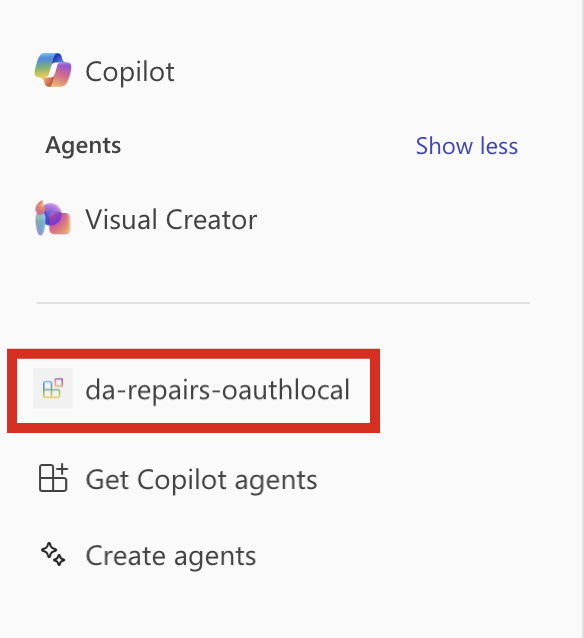

---
lab:
  title: 练习 4 - 在 Microsoft 365 Copilot Chat 中测试声明性代理
  module: 'LAB 05: Authenticate your API plugin for declarative agents with secured APIs'
---

# 练习 34 - 在智能 Microsoft 365 Copilot 副驾驶® 中测试声明性代理

在本练习中，你将测试声明性代理并将其部署到 Microsoft 365，并使用 Microsoft 365 Copilot Chat 对其进行测试。

### 练习用时

- **估计完成时间：** 5 分钟

## 任务 1 - 在 Microsoft 365 Copilot 中使用 API 插件测试声明性代理

最后一步是在智能 Microsoft 365 Copilot 副驾驶® 中使用 API 插件测试声明性代理。

在 Visual Studio Code 中：

1. 在活动栏中，打开“**Teams 工具包**”扩展。
1. 在“**Teams 工具包**”扩展面板中的“**帐户**”部分中，确保已登录到 Microsoft 365 租户。

    

1. 在“活动栏”中，切换到 **“运行和调试”** 视图。
1. 在配置列表中，选择 **Copilot (Edge) 中的“调试”**，然后按播放按钮开始调试。

    

    Visual Studio Code 打开智能 Microsoft 365 Copilot 副驾驶® 的新 Web 浏览器。 如果系统提示登录，请使用 Microsoft 365 帐户登录。

在 Web 浏览器中：

1. 在侧面板中，选择 **da-repairs-oauthlocal** 代理。

    

1. 在提示文本框中，键入`Show repair records assigned to Karin Blair`，然后提交提示。

    > [!TIP]
    > 你可以从对话开场白中选择它，而不是键入提示。

    

1. 确认要使用“**始终允许**”按钮将数据发送到 API 插件。

    

1. 出现提示时，通过选择“**登录到 da-repairs-oauthlocal**”，登录到 API 以继续使用用于登录到 Microsoft 365 租户的同一帐户。

    

1. 等待代理响应。

    

尽管 API 在本地计算机上运行，因而可以匿名访问，但智能 Microsoft 365 Copilot 副驾驶® 正在调用通过 API 规范中指定的身份验证的 API。可以通过在 **repairs** 函数中设置断点并在声明性代理中提交另一个提示来验证请求是否包含访问令牌。 当代码到达断点时，展开 req.headers 集合并查找包含 JSON Web 令牌（JWT）的授权标头。

完成测试后，停止 Visual Studio Code 中的调试会话。
